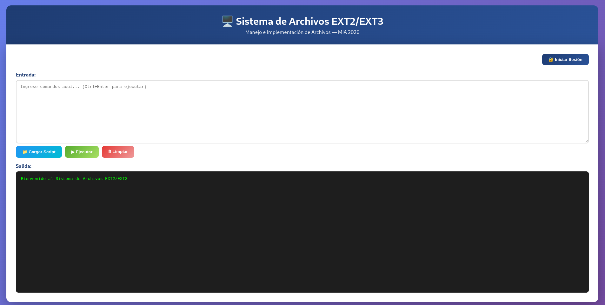
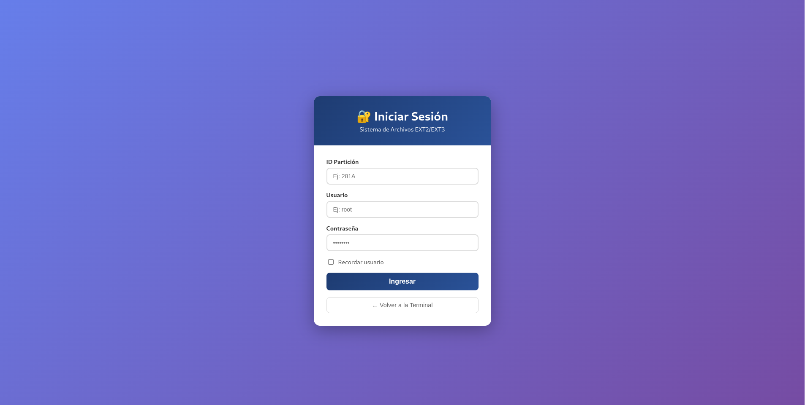
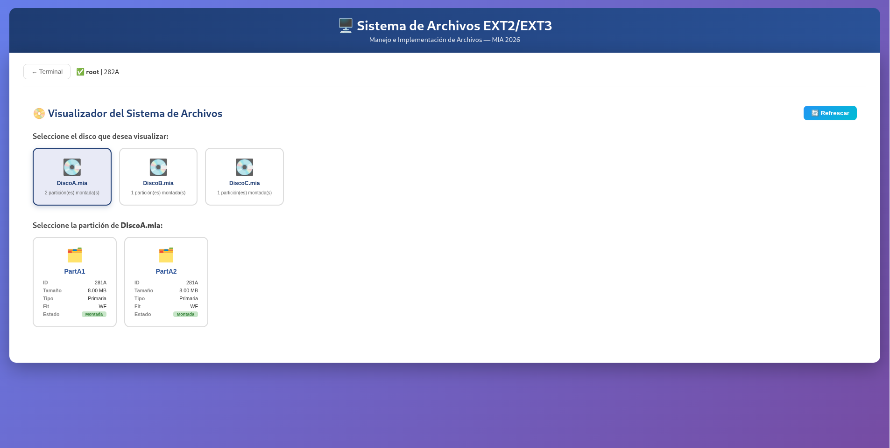
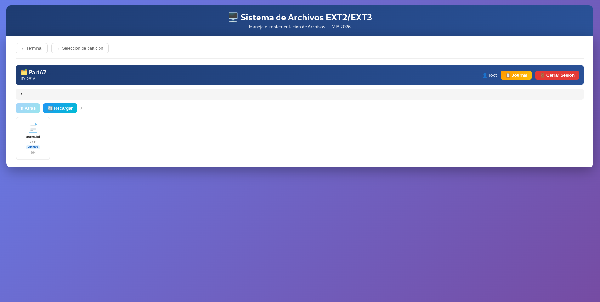
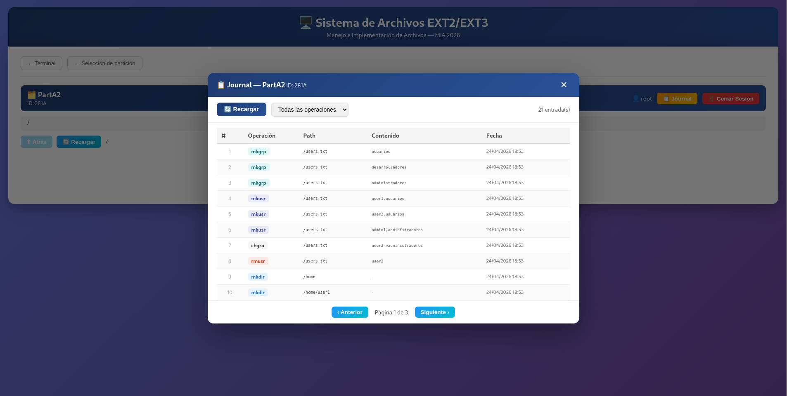

# Manual de Usuario - Sistema de Archivos EXT2/EXT3

## Tabla de Contenidos

1. [Introducción](#introducción)
2. [Requisitos del Sistema](#requisitos-del-sistema)
3. [Instalación y Configuración](#instalación-y-configuración)
4. [Guía de Inicio Rápido](#guía-de-inicio-rápido)
5. [Interfaz Gráfica](#interfaz-gráfica)
6. [Comandos Disponibles](#comandos-disponibles)
7. [Ejemplos de Uso](#ejemplos-de-uso)

---

## Introducción

Bienvenido al **Sistema de Archivos EXT2/EXT3** — una aplicación web que te permite crear y gestionar discos virtuales con sistemas de archivos similares a Linux EXT2 y EXT3, incluyendo soporte de journaling y un explorador visual de archivos.

### ¿Qué puedes hacer con este sistema?

- Crear y eliminar discos virtuales
- Particionar discos (primarias, extendidas, lógicas) con soporte de redimensionado y eliminación
- Formatear particiones con sistema EXT2 o EXT3
- Gestionar usuarios y grupos
- Crear, eliminar, renombrar, copiar y mover archivos y carpetas
- Buscar archivos con patrones (wildcards)
- Cambiar propietarios y permisos de archivos
- Ver el journal de operaciones (particiones EXT3)
- Simular pérdida de datos y recuperación mediante journal
- Explorar visualmente el sistema de archivos desde la interfaz
- Generar reportes gráficos del estado del sistema

### Interfaz de Usuario

El sistema cuenta con tres vistas principales:

- **Página Principal (Terminal):** Ejecución de comandos y carga de scripts.
- **Página de Login:** Inicio de sesión gráfico en una partición montada.
- **Visualizador del Sistema de Archivos:** Explorador visual de discos, particiones y archivos.

---

## Requisitos del Sistema

### Para ejecución local (desarrollo)

- **Sistema Operativo:** Linux
- **Compilador:** g++ 9.0 o superior
- **Node.js:** Versión 14.0 o superior
- **npm:** Incluido con Node.js
- **Graphviz:** Para generación de reportes gráficos

**Instalación de dependencias en Ubuntu:**
```bash
sudo apt update
sudo apt install -y g++ nodejs npm graphviz
```

### Para acceso en la nube (producción)

Solo necesitas un navegador web moderno. El sistema está desplegado en AWS con:
- **Frontend:** Bucket S3 (sitio web estático, accesible por URL pública)
- **Backend:** Instancia EC2 Ubuntu con el servidor Node.js y el binario C++

---

## Instalación y Configuración

### Ejecución local

#### Paso 1: Compilar el Backend

```bash
cd backend
g++ -std=c++17 -Wall -I. main.cpp -o disk_manager
chmod +x disk_manager
```

#### Paso 2: Instalar dependencias del servidor

```bash
cd ../server
npm install
```

#### Paso 3: Iniciar el Servidor

```bash
npm start
```

Deberías ver:
```
Servidor corriendo en http://localhost:4000
```

#### Paso 4: Iniciar el Frontend

En otra terminal:

```bash
cd ../frontend
npm install
npm start
```

Accede en tu navegador a:
```
http://localhost:3000
```

---

## Guía de Inicio Rápido

### Flujo básico para crear y explorar un sistema de archivos

#### 1. Crear un disco y montar una partición

Escribe los siguientes comandos en la terminal web (puedes escribirlos todos a la vez y pulsar **Ejecutar**):

```bash
mkdisk -size=50 -unit=M -path=~/discos/disco1.mia
fdisk -size=40 -unit=M -path=~/discos/disco1.mia -type=P -name=Particion1
mount -path=~/discos/disco1.mia -name=Particion1
```

Tras ejecutar `mount`, la salida mostrará el ID asignado (por ejemplo `281A`). Anótalo.

#### 2. Formatear la partición

```bash
# EXT2 (sin journaling)
mkfs -id=281A

# EXT3 (con journaling)
mkfs -id=281A -fs=3fs
```

#### 3. Iniciar sesión desde la interfaz gráfica

Haz clic en **Iniciar Sesión** en la esquina superior derecha. Introduce:
- **ID Partición:** `281A`
- **Usuario:** `root`
- **Contraseña:** `123`

Pulsa **Ingresar**.

#### 4. Crear estructura de archivos (desde la terminal)

```bash
mkdir -p -path=/home/documentos
mkfile -path=/home/documentos/notas.txt -size=200
mkfile -path=/home/documentos/config.txt -cont=/etc/hostname
cat -file1=/home/documentos/notas.txt
```

#### 5. Explorar el visualizador

Con sesión activa, haz clic en **📁 Visualizador**. Desde allí puedes:
- Seleccionar el disco `disco1.mia`
- Seleccionar la partición `Particion1`
- Navegar las carpetas y ver el contenido de los archivos

---

## Interfaz Gráfica

### Página Principal (Terminal)

La pantalla de inicio cuenta con:

- **Área de Entrada:** Campo de texto donde escribir comandos o pegar scripts completos.
- **Botón 📁 Cargar Script:** Permite cargar un archivo `.smia` desde tu equipo. El contenido se copia en el área de entrada.
- **Botón ▶ Ejecutar:** Envía todos los comandos del área de entrada al servidor y muestra la salida.
- **Botón 🗑 Limpiar:** Borra el área de salida.
- **Botón 🔐 Iniciar Sesión / 🚪 Cerrar Sesión:** Gestión de sesión.
- **Botón 📁 Visualizador:** Abre el explorador gráfico (disponible solo con sesión activa).
- **Área de Salida:** Terminal estilo oscuro que muestra los resultados de cada comando ejecutado.



### Página de Login

Formulario con tres campos:
- **ID Partición:** El identificador asignado por el comando `mount` (ej: `281A`).
- **Usuario:** Nombre de usuario registrado en la partición.
- **Contraseña:** Contraseña del usuario.
- **Recordar usuario:** Guarda usuario e ID en el navegador para futuras sesiones.



### Visualizador del Sistema de Archivos

#### Selección de disco

Muestra todos los discos que han tenido particiones montadas durante la sesión actual. Cada disco presenta:
- Nombre del archivo `.mia`
- Número de particiones montadas

#### Selección de partición

Al seleccionar un disco, se muestran sus particiones con:
- **ID:** Identificador de montaje
- **Tamaño:** En KB o MB
- **Tipo:** Primaria, Extendida o Lógica
- **Fit:** Algoritmo de ajuste usado al crear la partición
- **Estado:** Montada / Desmontada



#### Explorador de archivos

Una vez seleccionada una partición, el explorador muestra:
- **Breadcrumb de navegación:** Ruta actual con enlaces a cada nivel.
- **Botones ⬆ Atrás y 🔄 Recargar:** Navegación y actualización del directorio actual.
- **Grilla de elementos:** Carpetas (📁) y archivos (📄) con nombre, tamaño y tipo.
- Al hacer clic en una **carpeta**, se entra en ella.
- Al hacer clic en un **archivo**, se abre un modal con su contenido completo.
- **Botón 📋 Journal:** Abre el visualizador de journal (solo EXT3).
- **Botón 🚪 Cerrar Sesión:** Cierra la sesión activa.



#### Visualizador de Journal

Accesible desde el explorador de archivos. Muestra una tabla con:
- Número de entrada
- **Operación:** mkdir, mkfile, remove, rename, copy, move, chown, chmod, mkusr, etc.
- **Path:** Ruta donde se realizó la operación
- **Contenido:** Información adicional relevante
- **Fecha:** Fecha y hora de la operación

Incluye filtro por tipo de operación y paginación (10 entradas por página).



---

## Comandos Disponibles

### Gestión de Discos

#### MKDISK — Crear disco virtual

```bash
mkdisk -size=N -unit=[k|m] -path=ruta
```

| Parámetro | Tipo | Descripción |
|---|---|---|
| `-size` | Obligatorio | Tamaño del disco (número positivo) |
| `-unit` | Opcional | `k` para KB, `m` para MB (por defecto: `m`) |
| `-path` | Obligatorio | Ruta donde se guardará el archivo `.mia` |

**Ejemplos:**
```bash
mkdisk -size=100 -unit=M -path=~/discos/disco1.mia
mkdisk -size=2048 -unit=k -path=/tmp/disco2.mia
```

---

#### RMDISK — Eliminar disco

```bash
rmdisk -path=ruta
```

**Ejemplo:**
```bash
rmdisk -path=~/discos/disco1.mia
```

---

### Gestión de Particiones

#### FDISK — Crear, eliminar o redimensionar particiones

**Crear partición:**
```bash
fdisk -size=N -unit=[b|k|m] -path=ruta -type=[P|E|L] -fit=[BF|FF|WF] -name=nombre
```

**Eliminar partición:**
```bash
fdisk -delete=[fast|full] -name=nombre -path=ruta
```

**Redimensionar partición:**
```bash
fdisk -add=N -unit=[b|k|m] -path=ruta -name=nombre
```

| Parámetro | Tipo | Descripción |
|---|---|---|
| `-size` | Obligatorio (crear) | Tamaño de la partición |
| `-unit` | Opcional | `b` bytes, `k` KB, `m` MB (por defecto: `k`) |
| `-path` | Obligatorio | Ruta del disco |
| `-type` | Opcional | `P` Primaria, `E` Extendida, `L` Lógica (por defecto: `P`) |
| `-fit` | Opcional | `BF` Best Fit, `FF` First Fit, `WF` Worst Fit (por defecto: `WF`) |
| `-name` | Obligatorio | Nombre de la partición (máx. 16 caracteres) |
| `-delete` | Opcional | `fast` (limpia tabla) o `full` (limpia tabla + rellena con \0) |
| `-add` | Opcional | Bytes a agregar (positivo) o quitar (negativo) |

**Restricciones:**
- Máximo 4 particiones primarias/extendidas por disco.
- Solo puede haber una partición extendida por disco.
- Las lógicas solo van dentro de la extendida.
- Al eliminar la extendida se eliminan todas sus lógicas.

**Ejemplos:**
```bash
# Partición primaria de 20 MB
fdisk -size=20 -unit=M -path=~/disco1.mia -type=P -fit=FF -name=Datos

# Partición lógica dentro de una extendida
fdisk -size=30 -unit=M -path=~/disco1.mia -type=E -name=Extendida
fdisk -size=10 -unit=M -path=~/disco1.mia -type=L -name=Logica1

# Eliminar partición
fdisk -delete=fast -name=Datos -path=~/disco1.mia

# Agregar 5 MB a una partición
fdisk -add=5 -unit=M -path=~/disco1.mia -name=Datos

# Quitar 500 KB de una partición
fdisk -add=-500 -unit=k -path=~/disco1.mia -name=Datos
```

---

#### MOUNT — Montar partición

```bash
mount -path=ruta -name=nombre
```

La salida muestra el **ID asignado** con el formato `DDNL`:
- `DD`: Últimos 2 dígitos del carnet (28)
- `N`: Número de partición en ese disco
- `L`: Letra del disco (A, B, C...)

**Ejemplo:**
```bash
mount -path=~/disco1.mia -name=Datos
# Resultado: ID → 281A
```

---

#### UNMOUNT — Desmontar partición

```bash
unmount -id=ID
```

**Ejemplo:**
```bash
unmount -id=281A
```

---

#### MOUNTED — Ver particiones montadas

```bash
mounted
```

Muestra todas las particiones actualmente montadas con su ID, disco, tipo, inicio y tamaño.

---

### Sistema de Archivos

#### MKFS — Formatear partición

```bash
mkfs -id=ID [-type=full] [-fs=2fs|3fs]
```

| Parámetro | Tipo | Descripción |
|---|---|---|
| `-id` | Obligatorio | ID de la partición montada |
| `-type` | Opcional | `full` (único valor disponible, por defecto `full`) |
| `-fs` | Opcional | `2fs` para EXT2, `3fs` para EXT3 (por defecto `2fs`) |

**Ejemplos:**
```bash
# Formatear en EXT2 (por defecto)
mkfs -id=281A

# Formatear en EXT3 (con journaling)
mkfs -id=281A -fs=3fs
```

**¿Qué crea MKFS?**
1. Superbloque con toda la información del sistema de archivos
2. Bitmaps de inodos y bloques (todos en `0`)
3. Carpeta raíz `/` (inodo 0)
4. Archivo `/users.txt` con el usuario root (inodo 1)
5. En EXT3: área de journal inicializada vacía

---

### Gestión de Usuarios

#### LOGIN — Iniciar Sesión

Desde la terminal:
```bash
login -user=usuario -pass=contraseña -id=ID
```

O desde el botón gráfico **🔐 Iniciar Sesión**.

**Usuario por defecto tras mkfs:**
- Usuario: `root`
- Contraseña: `123`

---

#### LOGOUT — Cerrar Sesión

Desde la terminal:
```bash
logout
```

O desde el botón gráfico **🚪 Cerrar Sesión**.

---

#### MKGRP — Crear grupo

```bash
mkgrp -name=nombre_grupo
```

> Solo puede ejecutarlo el usuario **root**.

**Ejemplo:**
```bash
mkgrp -name=ventas
```

---

#### RMGRP — Eliminar grupo

```bash
rmgrp -name=nombre_grupo
```

> Solo puede ejecutarlo el usuario **root**. No se puede eliminar el grupo `root`.

---

#### MKUSR — Crear usuario

```bash
mkusr -user=usuario -pass=contraseña -grp=grupo
```

| Parámetro | Restricción |
|---|---|
| `-user` | Máx. 10 caracteres |
| `-pass` | Máx. 10 caracteres |
| `-grp` | El grupo debe existir previamente |

**Ejemplo:**
```bash
mkgrp -name=ventas
mkusr -user=maria -pass=1234 -grp=ventas
```

---

#### RMUSR — Eliminar usuario

```bash
rmusr -user=usuario
```

---

#### CHGRP — Cambiar grupo de usuario

```bash
chgrp -user=usuario -grp=nuevo_grupo
```

---

#### CAT — Ver archivo de usuarios

```bash
cat -file1=/users.txt
```

**Salida de ejemplo:**
```
1,G,root
1,U,root,root,123
2,G,ventas
2,U,ventas,maria,1234
```

**Formato:**
- Grupos: `ID,G,nombre_grupo`
- Usuarios: `ID,U,grupo,usuario,contraseña`
- ID `0` indica que fue eliminado.

---

### Gestión de Archivos y Carpetas

#### MKDIR — Crear carpeta

```bash
mkdir [-p] -path=ruta
```

| Parámetro | Descripción |
|---|---|
| `-p` | Crea carpetas padre si no existen (opcional) |
| `-path` | Ruta completa de la carpeta a crear |

**Ejemplos:**
```bash
# Sin -p (el padre debe existir)
mkdir -path=/home/documentos

# Con -p (crea toda la jerarquía)
mkdir -p -path=/home/proyectos/2026/enero
```

---

#### MKFILE — Crear archivo

```bash
mkfile [-r] -path=ruta [-size=N] [-cont=archivo_real]
```

| Parámetro | Descripción |
|---|---|
| `-r` | Crea carpetas padre si no existen |
| `-size` | Tamaño en bytes (genera patrón `0123456789...`) |
| `-cont` | Ruta de un archivo real del sistema para copiar su contenido |

**Ejemplos:**
```bash
# Archivo con patrón numérico de 500 bytes
mkfile -path=/home/datos.txt -size=500

# Archivo con contenido de un archivo real
mkfile -path=/home/readme.txt -cont=/etc/hostname

# Con creación recursiva de carpetas padre
mkfile -r -path=/nueva/carpeta/archivo.txt -size=100
```

---

#### CAT — Ver contenido de archivo(s)

```bash
cat -file1=ruta [-file2=ruta] [-file3=ruta] ...
```

**Ejemplos:**
```bash
# Ver un archivo
cat -file1=/home/datos.txt

# Ver múltiples archivos
cat -file1=/home/datos.txt -file2=/home/notas.txt
```

---

#### REMOVE — Eliminar archivo o carpeta

```bash
remove -path=ruta
```

Elimina el archivo o carpeta y **todo su contenido** de forma recursiva. Antes de eliminar, verifica que el usuario tenga permisos de escritura sobre **todos** los elementos. Si alguno no tiene permiso, no se elimina nada.

**Ejemplos:**
```bash
# Eliminar un archivo
remove -path=/home/user/docs/a.txt

# Eliminar una carpeta y todo su contenido
remove -path=/home/user
```

---

#### RENAME — Renombrar archivo o carpeta

```bash
rename -path=ruta -name=nuevo_nombre
```

Requiere permiso de escritura sobre el elemento. El nuevo nombre no puede existir ya en el mismo directorio.

**Ejemplo:**
```bash
rename -path=/home/user/docs/a.txt -name=b.txt
```

---

#### COPY — Copiar archivo o carpeta

```bash
copy -path=origen -destino=destino
```

Copia recursivamente. Los archivos sin permiso de lectura se omiten (se copia el resto). El destino debe existir y tener permiso de escritura.

**Ejemplo:**
```bash
copy -path=/home/user/documentos -destino=/home/imagenes
```

---

#### MOVE — Mover archivo o carpeta

```bash
move -path=origen -destino=destino
```

Solo verifica permisos de escritura sobre el **origen**. Si origen y destino están en la misma partición, solo actualiza las referencias (no copia datos). El destino debe tener permiso de escritura.

**Ejemplo:**
```bash
move -path=/home/user/documentos -destino=/home/imagenes
```

---

#### FIND — Buscar archivos o carpetas

```bash
find -path=directorio_inicio -name=patron
```

| Carácter | Descripción |
|---|---|
| `?` | Exactamente un carácter cualquiera |
| `*` | Uno o más caracteres cualquiera |

**Ejemplos:**
```bash
# Buscar todo en el sistema
find -path=/ -name=*

# Buscar archivos con nombre de un solo carácter seguido de extensión
find -path=/home -name=?.*

# Buscar todos los archivos .txt
find -path=/ -name=*.txt
```

---

#### CHOWN — Cambiar propietario

```bash
chown [-r] -path=ruta -usuario=nombre
```

| Parámetro | Descripción |
|---|---|
| `-path` | Ruta del archivo o carpeta |
| `-usuario` | Nombre del nuevo propietario (debe existir) |
| `-r` | Aplica recursivamente a toda la jerarquía |

**Ejemplos:**
```bash
# Cambiar propietario de un archivo
chown -path=/home/datos.txt -usuario=maria

# Cambiar propietario de una carpeta y todo su contenido
chown -r -path=/home/user -usuario=carlos
```

---

#### CHMOD — Cambiar permisos

```bash
chmod [-r] -path=ruta -ugo=NNN
```

| Parámetro | Descripción |
|---|---|
| `-path` | Ruta del archivo o carpeta |
| `-ugo` | Tres dígitos 0-7 para Usuario, Grupo, Otros |
| `-r` | Aplica recursivamente |

**Tabla de permisos:**

| Número | Binario | Permisos |
|---|---|---|
| 7 | 111 | Lectura + Escritura + Ejecución |
| 6 | 110 | Lectura + Escritura |
| 5 | 101 | Lectura + Ejecución |
| 4 | 100 | Solo Lectura |
| 2 | 010 | Solo Escritura |
| 0 | 000 | Sin permisos |

**Ejemplos:**
```bash
# Permisos rwxrw-r-- para una carpeta
chmod -path=/home/user -ugo=764

# Permisos totales recursivamente
chmod -r -path=/home -ugo=777
```

---

### Generación de Reportes

#### REP — Crear reportes gráficos

```bash
rep -id=ID -path=ruta_salida -name=tipo [-path_file_ls=ruta]
```

| Tipo | Descripción | Extensión recomendada |
|---|---|---|
| `mbr` | Estructura del MBR y sus particiones | `.jpg` / `.png` |
| `disk` | Mapa de ocupación del disco | `.jpg` / `.png` |
| `inode` | Tabla de inodos en uso | `.jpg` / `.png` |
| `block` | Bloques en uso (carpeta, archivo, apuntadores) | `.jpg` / `.png` |
| `bm_inode` | Bitmap de inodos | `.txt` |
| `bm_block` | Bitmap de bloques | `.txt` |
| `tree` | Árbol completo del sistema de archivos | `.png` |
| `sb` | Información del Superbloque | `.jpg` / `.png` |
| `file` | Contenido de un archivo específico | `.jpg` / `.png` |
| `ls` | Listado de un directorio | `.jpg` / `.png` |

**Ejemplos:**
```bash
# Reporte del MBR
rep -id=281A -path=~/reportes/mbr.jpg -name=mbr

# Árbol del sistema de archivos
rep -id=281A -path=~/reportes/arbol.png -name=tree

# Bitmap de inodos (archivo de texto)
rep -id=281A -path=~/reportes/bitmap_inodos.txt -name=bm_inode

# Listado de una carpeta específica
rep -id=281A -path=~/reportes/listado.jpg -name=ls -path_file_ls=/home
```

---

### Journaling (solo EXT3)

#### JOURNALING — Ver journal de una partición

```bash
journaling -id=ID
```

Muestra en la terminal todas las transacciones registradas: operación, path, contenido y fecha. En la interfaz gráfica, usa el botón **📋 Journal** dentro del explorador de archivos.

**Ejemplo:**
```bash
journaling -id=281A
```

---

#### LOSS — Simular pérdida del sistema de archivos

```bash
loss -id=ID
```

Limpia con ceros los bitmaps, área de inodos y área de bloques de una partición EXT3, simulando un fallo en disco. El Superblock y el Journal se mantienen intactos.

**Ejemplo:**
```bash
loss -id=281A
```

---

## Ejemplos de Uso

### Ejemplo 1: Sistema con EXT3 y journaling

```bash
# Crear y configurar disco
mkdisk -size=100 -unit=M -path=~/disco_ext3.mia
fdisk -size=80 -unit=M -path=~/disco_ext3.mia -type=P -name=Part1
mount -path=~/disco_ext3.mia -name=Part1
mkfs -id=281A -fs=3fs

# Iniciar sesión
login -user=root -pass=123 -id=281A

# Crear estructura
mkdir -p -path=/proyectos/web
mkdir -p -path=/proyectos/mobile
mkfile -path=/proyectos/web/index.txt -size=300
mkfile -path=/proyectos/mobile/app.txt -size=200

# Operaciones que se registran en el journal
rename -path=/proyectos/web/index.txt -name=index2.txt
copy -path=/proyectos/web -destino=/proyectos/backup
remove -path=/proyectos/mobile/app.txt

# Ver el journal desde la terminal
journaling -id=281A

# O desde la interfaz: Visualizador → Partición → 📋 Journal
```

---

### Ejemplo 2: Sistema multiusuario con permisos

```bash
# Configurar disco (asumiendo mkdisk, fdisk, mount, mkfs ya ejecutados)
login -user=root -pass=123 -id=281A

# Crear grupos y usuarios
mkgrp -name=devs
mkgrp -name=ops
mkusr -user=ana -pass=ana123 -grp=devs
mkusr -user=bob -pass=bob123 -grp=ops

# Crear estructura con distintos permisos
mkdir -p -path=/proyectos/devs
mkdir -p -path=/proyectos/ops
mkfile -path=/proyectos/devs/codigo.txt -size=500
mkfile -path=/proyectos/ops/config.txt -size=200

# Cambiar propietarios
chown -path=/proyectos/devs/codigo.txt -usuario=ana
chown -path=/proyectos/ops/config.txt -usuario=bob

# Cambiar permisos
chmod -path=/proyectos/devs/codigo.txt -ugo=640
chmod -path=/proyectos/ops/config.txt -ugo=600

logout

# Iniciar sesión como usuario normal
login -user=ana -pass=ana123 -id=281A
cat -file1=/proyectos/devs/codigo.txt  # OK: ana es propietaria
cat -file1=/proyectos/ops/config.txt   # Error: sin permiso

logout
```
---

### Ejemplo 3: Script completo (.smia)

Puedes cargar un script desde la interfaz con el botón **📁 Cargar Script**:

```bash
# script_demo.smia
mkdisk -size=50 -unit=M -path=~/demo.mia
fdisk -size=40 -unit=M -path=~/demo.mia -type=P -name=Demo
mount -path=~/demo.mia -name=Demo
mkfs -id=281A -fs=3fs
login -user=root -pass=123 -id=281A
mkgrp -name=usuarios
mkusr -user=pepe -pass=pepe -grp=usuarios
mkdir -p -path=/home/pepe
mkfile -path=/home/pepe/bienvenida.txt -size=100
chown -path=/home/pepe -r -usuario=pepe
chmod -r -path=/home/pepe -ugo=755
cat -file1=/home/pepe/bienvenida.txt
journaling -id=281A
logout
```
